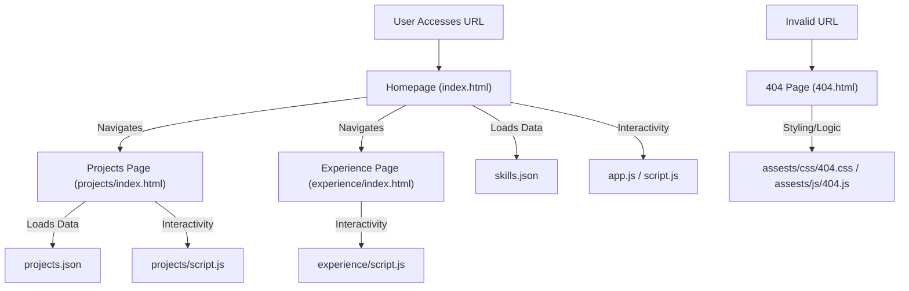

# 🚀 Portfolio Website

<p align="center"></p>

<p align="center">
  <a href="https://github.com/grewal16/portfolio_website/stargazers"></a>
  <a href="https://github.com/grewal16/portfolio_website/network/members"></a>
  <a href="https://github.com/grewal16/portfolio_website/issues"></a>
  <a href="./LICENSE"></a>
</p>

## Short Description
Unleash your professional narrative with this dynamic and highly responsive personal portfolio website. Crafted for impact, this project provides a sleek, modern, and interactive platform to showcase your skills, experience, and projects. It's not just a website; it's a digital representation of your expertise, designed to leave a lasting impression.

## ✨ Key Features
*   **Stunning & Responsive Design:** Adapts beautifully across all devices, from desktops to mobile phones, ensuring a seamless user experience.
*   **Dedicated Sections:** Clearly organized sections for projects, skills, and professional experience, making navigation intuitive.
*   **Interactive UI/UX:** Engaging visual elements and smooth transitions powered by modern JavaScript.
*   **Automated Deployment (CI/CD):** Integrated GitHub Actions workflow ensures continuous integration and delivery for effortless updates.
*   **Data-Driven Content:** Easily manage and update your projects and skills via simple JSON files, keeping your portfolio always current.
*   **Custom 404 Page:** A branded and user-friendly error page enhances the overall professionalism.
*   **Optimized Performance:** Fast loading times and a smooth browsing experience.

## Who is this for?
This project is ideal for:
*   **Software Developers & Engineers:** Looking for a polished, ready-to-deploy platform to highlight their technical prowess.
*   **Designers & Creatives:** Seeking a visually appealing site to display their creative portfolio.
*   **Job Seekers:** Who want to stand out to recruiters with a professional online presence.
*   **Students & Graduates:** Building their first impressive portfolio.
*   **Anyone** wanting a robust and attractive personal website without building from scratch.

## Technology Stack & Architecture
This portfolio website leverages a powerful combination of modern frontend technologies and development practices:

*   **Frontend:** HTML5, CSS3, JavaScript
*   **Styling:** Custom CSS (`assests/css/style.css`, `assests/css/404.css`) for a unique aesthetic.
*   **Interactivity:** Vanilla JavaScript (`assests/js/app.js`, `assests/js/script.js`, `assests/js/404.js`) with external libraries like `particles.min.js` for dynamic backgrounds.
*   **Content Management:** JSON files (`projects/projects.json`, `skills.json`) for easily structured and modifiable data.
*   **Version Control:** Git & GitHub.
*   **Deployment Automation:** GitHub Actions (`.github/workflows/ci-cd.yml`) for streamlined CI/CD to static hosting platforms (e.g., GitHub Pages).

## 📊 Architecture & Database Schema
This project is a static site with no backend database. Its architecture focuses on a client-side rendering model, fetching data from local JSON files.



## ⚡ Quick Start Guide
Get your personalized portfolio up and running in minutes!

1.  **Clone the Repository:**
    ```bash
    git clone https://github.com/grewal16/portfolio_website.git
    cd portfolio_website
    ```
2.  **Open in Browser:** Simply open `index.html` in your web browser to view the portfolio locally.
3.  **Customize Content:**
    *   Edit `projects/projects.json` to add or modify your projects.
    *   Update `skills.json` with your technical skills.
    *   Replace `assests/resume.pdf` with your own resume.
    *   Personalize images in `assests/images/` and text content within the `.html` files.
4.  **Deploy:** Push your changes to your GitHub repository, and the integrated CI/CD pipeline will handle deployment to GitHub Pages (or configure for your preferred static hosting).

## 📜 License
This project is licensed under the terms of the [MIT License](LICENSE).