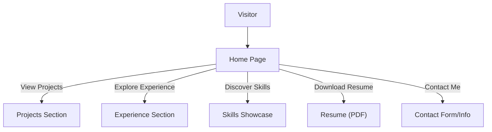

# 🚀 Personal Portfolio Website

<p align="center"></p>

## Short Description
This is a sleek, modern, and highly interactive personal portfolio website designed to showcase your professional skills, projects, and career journey. Engineered for responsiveness and dynamic content, it provides an engaging experience for visitors, potential employers, and collaborators alike.

## ✨ Key Features
*   **Dynamic Project Showcase:** Browse a curated collection of your projects, complete with detailed descriptions, imagery, and links, powered by a structured JSON data source (`projects/projects.json`).
*   **Comprehensive Experience Timeline:** Present your professional background and educational history through a beautifully organized and easily digestible section.
*   **Interactive Skills Presentation:** Highlight your technical proficiencies with a data-driven skills section (`skills.json`) that can be easily updated and expanded.
*   **Responsive & Modern UI:** Crafted with HTML5, CSS3, and JavaScript to ensure a seamless and visually appealing experience across all devices.
*   **Engaging Animations & Interactivity:** Utilizes libraries like Particles.js (`assests/js/particles.min.js`) and custom JavaScript for captivating visual effects and a dynamic user interface.
*   **Integrated Resume:** Provides direct access to your professional resume (`assests/resume.pdf`) for easy download and review by recruiters.
*   **Automated CI/CD:** Features a robust Continuous Integration/Continuous Deployment pipeline (`.github/workflows/ci-cd.yml`) ensuring swift and reliable deployments of updates.
*   **Dedicated 404 Page:** A custom 404 error page (`404.html`) ensures a consistent brand experience even when content is not found.

## Who is this for?
This portfolio is ideal for:
*   **Developers & Designers:** Showcase your technical prowess and design sensibilities.
*   **Job Seekers:** Impress recruiters and hiring managers with a professional online presence.
*   **Freelancers & Consultants:** Present your work and services to potential clients.
*   **Anyone** looking to establish a strong, interactive personal brand online.

## Technology Stack & Architecture
This project is built as a highly performant static website, focusing on delivering a fast and secure user experience.

*   **Frontend:**
    *   **HTML5:** Structure and content.
    *   **CSS3:** Styling and responsive design (leveraging `style.css`, `404.css`).
    *   **JavaScript:** Interactivity, animations, and dynamic content loading (using `app.js`, `script.js`, `particles.min.js`).
*   **Data Management:**
    *   **JSON:** For dynamic loading of projects (`projects/projects.json`) and skills (`skills.json`).
*   **Development Tools & CI/CD:**
    *   **VS Code:** Primary development environment.
    *   **GitHub Actions:** Automated CI/CD workflows for testing and deployment.

## 📊 Architecture & Database Schema
As a static site, this portfolio does not utilize a database. Its architecture is purely client-side, with content being served directly to the browser. The flow below illustrates how a visitor interacts with the website:



## ⚡ Quick Start Guide
To get a copy of this project up and running on your local machine for development and testing purposes, follow these simple steps:

1.  **Clone the repository:**
    ```bash
    git clone https://github.com/grewal16/portfolio_website.git
    cd portfolio_website
    ```
2.  **Open in your browser:**
    Simply open the `index.html` file in your preferred web browser. No special server setup is required for local viewing.
    ```bash
    # Example for Linux/macOS
    open index.html
    # Example for Windows
    start index.html
    ```

## 📜 License
This project is open-sourced under the MIT License. See the [LICENSE](LICENSE) file for more details.