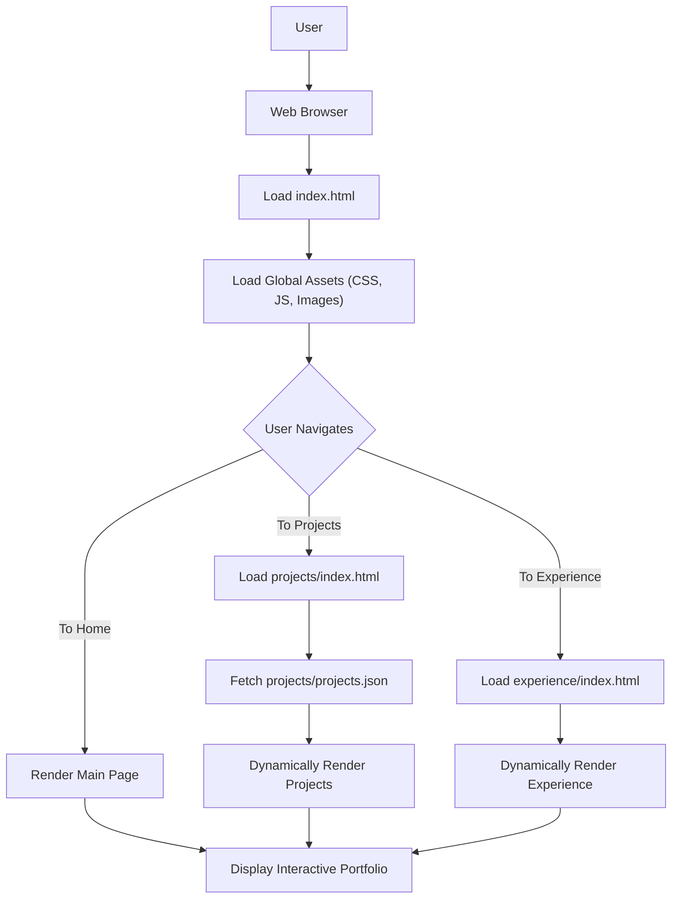

# 🚀 Portfolio Website

<p align="center"></p>

## Short Description
Embark on a journey through the digital realm with this meticulously crafted personal portfolio website. Designed as a dynamic and immersive showcase, this platform vividly highlights a developer's skills, projects, and professional experience. It's more than just a resume; it's an interactive story of innovation, problem-solving, and dedication, engineered to captivate and inform.

## ✨ Key Features
*   **Interactive Project Showcase:** Explore a diverse array of projects with dedicated sections, dynamically loaded from `projects.json` for easy management.
*   **Comprehensive Experience Timeline:** Navigate through a detailed timeline of professional and educational milestones, presenting a clear career trajectory.
*   **Dynamic Skills Display:** Get a quick overview of technical proficiencies, powered by an organized `skills.json` dataset.
*   **Responsive & Modern Design:** Enjoy a seamless viewing experience across all devices, thanks to a fluid and adaptive user interface crafted with modern CSS.
*   **Visual Enhancements:** Engages visitors with captivating animations, smooth transitions, and a subtle particle background effect for an immersive feel.
*   **Integrated Resume:** Provides a direct link to a professional resume (`assests/resume.pdf`) for easy access and detailed information.
*   **Automated Deployment (CI/CD):** Leverages GitHub Actions for robust Continuous Integration and Continuous Deployment, ensuring the website is always up-to-date and reliably delivered.
*   **Elegant Error Handling:** Features a custom 404 page for a polished user experience, even when navigation goes awry.

## Who is this for?
This portfolio website is an essential tool for:
*   **Aspiring Developers:** To learn from a well-structured, modern frontend project.
*   **Recruiters & Hiring Managers:** To efficiently evaluate skills, experience, and project contributions.
*   **Collaborators:** To understand a developer's expertise and identify potential synergy.
*   **Clients:** To review past work and assess capabilities for future engagements.
*   **Anyone curious** about a developer's technical journey and accomplishments.

## Technology Stack & Architecture
This project is built using a robust and widely adopted set of frontend technologies, ensuring high performance, maintainability, and broad compatibility.

*   **Frontend Development:**
    *   **HTML5:** For structuring the web content.
    *   **CSS3:** For styling and responsive design, including custom animations.
    *   **JavaScript (ES6+):** For interactive elements, dynamic content loading, and visual effects (e.g., `particles.min.js`).
*   **Content Management:**
    *   **JSON:** Used for storing and dynamically rendering project details (`projects.json`) and skills information (`skills.json`).
*   **Development Tools:**
    *   **VS Code:** Configuration for a streamlined development environment (`.vscode/settings.json`).
*   **Continuous Integration/Continuous Deployment (CI/CD):**
    *   **GitHub Actions:** Automates the testing and deployment workflow, ensuring efficient updates (`.github/workflows/ci-cd.yml`).

## 📊 Architecture & Database Schema
Given this is a static portfolio website, a traditional database schema isn't applicable. Instead, the architecture focuses on efficient content delivery and a smooth user experience, leveraging local JSON files for dynamic data.



## ⚡ Quick Start Guide
To get this modern portfolio website up and running on your local machine, follow these simple steps:

1.  **Clone the Repository:**
    ```bash
    git clone https://github.com/grewal16/portfolio_website.git
    cd portfolio_website
    ```

2.  **Open in Browser:**
    As this is a static website, you can simply open the `index.html` file in your preferred web browser.
    ```bash
    # For Linux/macOS
    open index.html
    # For Windows
    start index.html
    ```
    Alternatively, for a local web server experience, you can use a simple Python server:
    ```bash
    python -m http.server 8000
    ```
    Then, navigate to `http://localhost:8000` in your browser.

3.  **Customize Your Content:**
    *   Edit `index.html` and other HTML files for static content.
    *   Update `projects/projects.json` with your project details.
    *   Modify `skills.json` to reflect your technical proficiencies.
    *   Replace `assests/resume.pdf` with your own resume.
    *   Personalize images in `assests/images/` and styles in `assests/css/` to match your brand.

## 📜 License
This project is licensed under the terms of the [LICENSE](LICENSE) file.