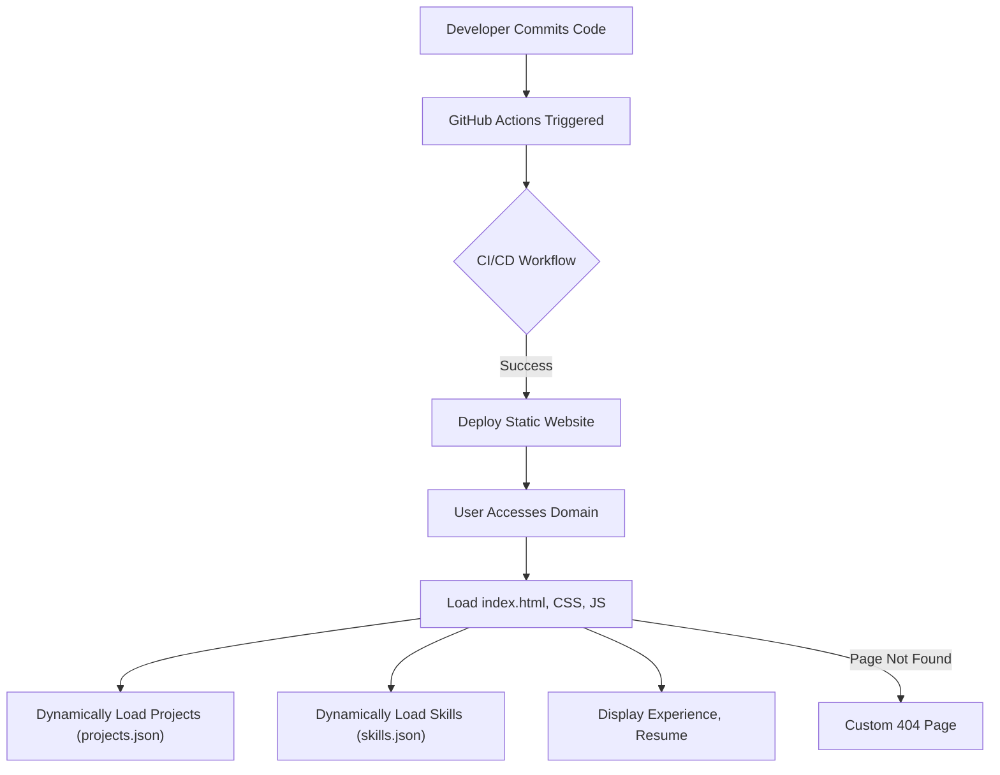

# 🚀 Dynamic Developer Portfolio

<p align="center"></p>

## Short Description
Presenting the **Dynamic Developer Portfolio**, a highly customizable and interactive personal website designed to effectively showcase your skills, projects, and professional experience. Crafted with modern web technologies, this portfolio delivers a sleek, responsive, and engaging user experience, ensuring your professional story is told with maximum impact.

## ✨ Key Features
*   **Immersive User Interface:** A modern and responsive design that provides a seamless experience across all devices.
*   **Dynamic Content Loading:** Projects and skills are loaded from intuitive JSON files, allowing for effortless content updates without touching HTML.
*   **Dedicated Sections:** Clearly organized sections for showcasing your professional experience and a diverse range of projects.
*   **Integrated Resume:** A direct download link for your resume (PDF) making it easy for recruiters to access your full credentials.
*   **Automated Deployment (CI/CD):** Leverages GitHub Actions for continuous integration and continuous deployment, ensuring your latest work is always live with every push.
*   **Custom 404 Page:** A branded and user-friendly custom 404 error page for an enhanced user journey.
*   **Interactive Elements:** Engaging visual effects, powered by libraries like Particles.js, to capture and retain visitor attention.

## Who is this for?
This portfolio is meticulously designed for:
*   **Software Developers & Engineers:** To present their technical prowess and project contributions.
*   **Web Designers & Frontend Developers:** To exhibit their aesthetic sense and interactive design skills.
*   **Freelancers & Consultants:** To attract new clients by displaying a professional and comprehensive overview of their capabilities.
*   **Job Seekers:** To stand out to recruiters and hiring managers with an impressive online presence.

## Technology Stack & Architecture
This project is built using a robust and widely adopted technology stack for modern static web development:

*   **Frontend:** HTML5, CSS3, JavaScript (Vanilla JS, with libraries like `particles.min.js` for visual flair)
*   **Styling:** Custom CSS, organized for maintainability and scalability.
*   **Deployment:** GitHub Actions for streamlined CI/CD.
*   **Content Management:** JSON files (`projects.json`, `skills.json`) for dynamic data loading.

## 📊 Architecture & Database Schema
This project follows a static site architecture, where content is served directly to the browser. While there's no traditional database, content for dynamic sections is managed through simple JSON files. The CI/CD pipeline ensures continuous delivery of updates.



## ⚡ Quick Start Guide
Get your personalized portfolio up and running in minutes!

1.  **Clone the Repository:**
    ```bash
    git clone https://github.com/Chiba-kun/portfolio_website.git
    cd portfolio_website
    ```

2.  **Open in Browser:**
    Simply open the `index.html` file in your preferred web browser to view the portfolio locally.

    ```bash
    # For Windows
    start index.html
    # For macOS
    open index.html
    # For Linux
    xdg-open index.html
    ```

3.  **Customize Content:**
    *   Update your personal details in `index.html`.
    *   Modify your skills in `skills.json`.
    *   Add or remove projects in `projects/projects.json`.
    *   Replace `assests/resume.pdf` with your own resume.
    *   Personalize images in `assests/images/`.

4.  **Deploy (Optional):**
    For automated deployment, set up GitHub Pages (or a similar static site host) and ensure your `.github/workflows/ci-cd.yml` is configured to deploy from your chosen branch.

## 📜 License
This project is licensed under the MIT License. See the `LICENSE` file for more details.