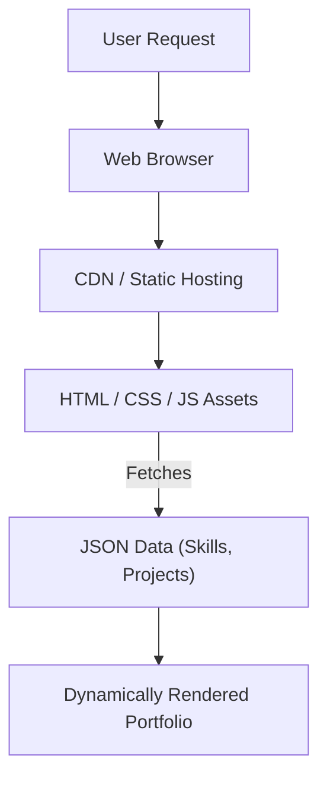

# 🚀 Portfolio Website

<p align="center"></p>

## Short Description
Dive into a sleek, modern, and highly customizable personal portfolio website template designed to showcase your skills, experience, and projects with compelling visual flair. This repository provides a robust foundation for developers, designers, and professionals to build their online presence effortlessly.

## 🛡️ Project Health & Status
This project is actively maintained and production-ready! It leverages robust GitHub Actions CI/CD pipelines, ensuring seamless deployment, consistent quality, and a smooth development workflow for continuous enhancements.

## ✨ Key Features
*   **Dynamic Content Management**: Easily update your skills and projects via intuitive JSON files, no need to touch HTML!
*   **Responsive Design**: A beautiful and consistent user experience across all devices, from desktops to mobile.
*   **Dedicated Sections**: Clearly structured `Home`, `Experience`, and `Projects` sections to highlight every aspect of your professional journey.
*   **Interactive Visuals**: Engage visitors with animated backgrounds powered by Particles.js and captivating hero sections.
*   **Integrated Resume Download**: Provide direct access to your resume with a dedicated PDF link.
*   **Custom 404 Page**: A thoughtful custom error page ensures a polished user experience even on broken links.
*   **Automated CI/CD**: Built-in GitHub Actions for streamlined testing and deployment processes.

## Who is this for?
This repository is perfect for **software developers, web designers, UI/UX specialists, and other creative professionals** who need a polished, dynamic, and easy-to-manage online platform to present their work, skills, and experience to potential employers, clients, or collaborators.

## Technology Stack & Architecture
This portfolio website is a testament to the power of modern web standards, crafted with simplicity and performance in mind.

*   **Frontend**: HTML5, CSS3, JavaScript
*   **Styling**: Pure CSS for highly optimized and customizable aesthetics, ensuring responsive layouts.
*   **Dynamic Content**: JSON files (`skills.json`, `projects/projects.json`) serve as the data backbone, allowing for easy updates without HTML modification.
*   **Automation**: GitHub Actions power the robust Continuous Integration and Continuous Deployment (CI/CD) pipeline.
*   **Visual Enhancements**: Integrates `Particles.js` for engaging, animated background effects.

## 📊 Architecture & Database Schema
Given its nature as a static site, this project emphasizes client-side rendering and direct asset delivery. There's no complex backend or traditional database, simplifying deployment and maximizing performance.



## ⚙️ Configuration & Deployment
Deployment for the Portfolio Website is elegantly handled through GitHub Actions. Once changes are pushed to the main branch, the CI/CD pipeline automatically builds and deploys the static assets, ensuring your portfolio is always up-to-date and accessible. No complex server-side configuration is required.

## ⚡ Quick Start Guide
Get your personalized portfolio up and running in minutes!

1.  **Clone the repository:**
    ```bash
    git clone https://github.com/grewal16/portfolio_website.git
    cd portfolio_website
    ```
2.  **Customize your content:**
    *   Edit `skills.json` to update your technical proficiencies.
    *   Modify `projects/projects.json` to showcase your latest work.
    *   Replace `assests/resume.pdf` with your own resume.
    *   Update image assets in `assests/images/` as needed.
3.  **Open in your browser:**
    Simply open the `index.html` file in your preferred web browser to view your local portfolio. For a production-like experience, serve it using a local static file server (e.g., `npx http-server`).
4.  **Deploy with GitHub Actions**:
    Push your changes to your GitHub repository, and the pre-configured CI/CD workflow will handle the deployment automatically.

## 📜 License
This project is licensed under the MIT License. See the [LICENSE](LICENSE) file for details.